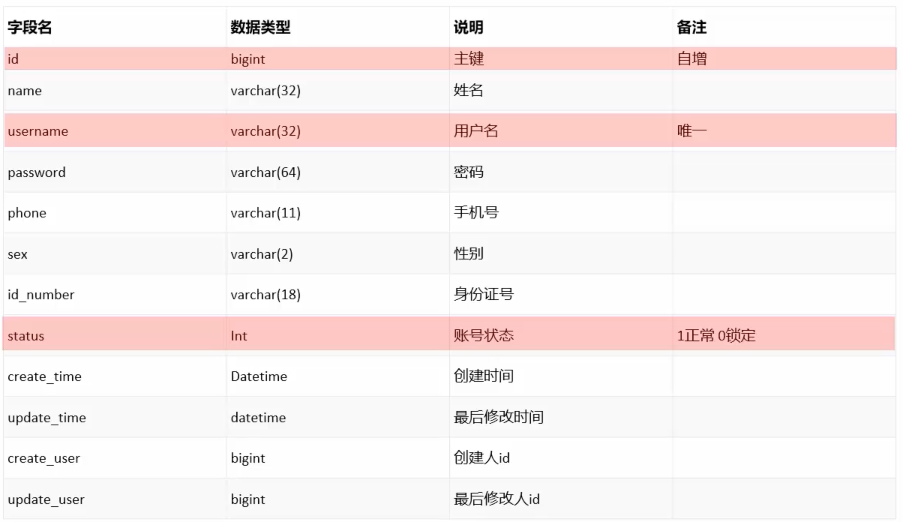
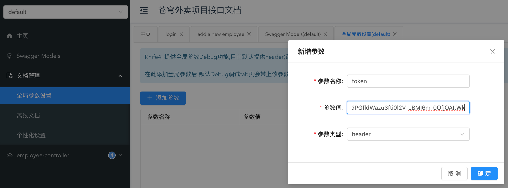
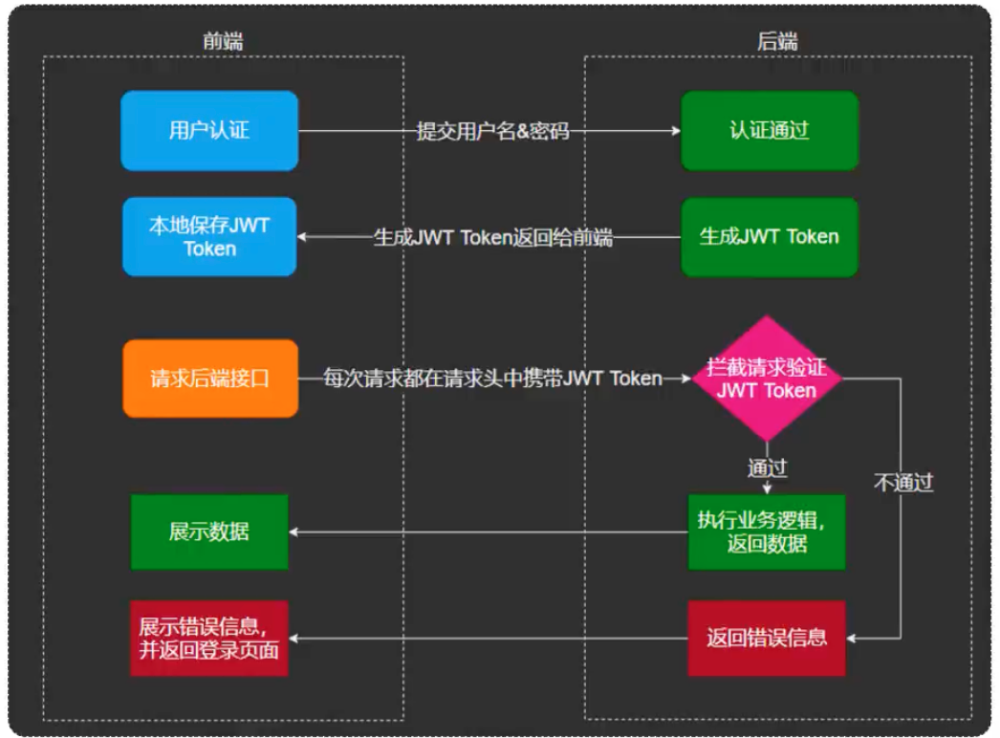

Day1 Employee & Category

[toc]

# Standard process

Let's take Employee as an example, it is a single-table CRUD case.

1. Requirements analyze. Product manager draw the product prototype html pages to show the functions and interactions.
2. Design. Experienced engineers design the api and table.
3. Devlopment. 
4. Test.
5. Perfect the scripts.

# Before devlopment

## prototype


This is a prototype designed by PM. Be careful we have some data limitations like user account should be unique, phone numbers must be 11. Some is implemented on the front side (a phone number is valid or not), some on the backend side (accout is normal or frozen), some on the database side (unique key).

## api design


This is an API of the above. In most cases, we make an apoitment that if the request is sent from the admin endpoint, we use `/admin`  as a prefix in the url, if the reqeust is sent from user side, we use `/user`  as a prefix.

## sql table design



This is a sql table design. We need to add specific limitations on some certain field, eg: id is primary key and auto increasing, username should be unique, status have a default value 1.

# Employee development

## preliminary devlopment

During design period, we should save all the API documents to YApi or some other similar tools. Open that YApi and check the api before writing the codes.


### controller layer

Why should we use a DTO? We often use a DTO when the data sent by front is quite different from the entity, or if the data is very simple and there is no need to validate the data, we can directly use parameters.

As the data we receive is json, we need to add a `RequestBody`, and add an `ApiOperation`  so that swagger can have a comment telling what does this function do.

Add an ApiOperation comment for swagger. It is better not write too much business related codes here in controller,  so here we let service to save the DTO instead of entity. Later we will transform the DTO into entity in service implementation and then call a mapping persistant layer to save it into database.

```java
@ApiOperation("add a new employee")
@PostMapping
public Result add(@RequestBody EmployeeDTO employeeDTO) {
    log.info("add a new employee: {}", employeeDTO);
    employeeService.save(employeeDTO);
    return Result.success();
}
```

### Service layer

It is feasible to use entity.setField(dto.getField), but use `BeanUtils.copyProperites(DTO, entity)`  will be much more covinient if most of the properties have the same name. Entity contains some field that does not exist in the DTO, which need us to independently set those values.

There is a constant folder in sky-pojo modules, it stores a lot of constant class. It is more of OOP to use class's properties and functions than hard code it.

As for the password, we cannot save the clear text password, here we use a `DigestUtils.md5DigestAsHex(password.getBytes())`  to generate a cryptographic password.

```java
public void save(EmployeeDTO employeeDTO) {
    Employee employee = new Employee();
    BeanUtils.copyProperties(employeeDTO, employee);
    employee.setStatus(StatusConstant.ENABLE);
    // set default password
    String password = DigestUtils.md5DigestAsHex(PasswordConstant.DEFAULT_PASSWORD.getBytes());
    employee.setPassword(password);

    employee.setCreateTime(LocalDateTime.now());
    employee.setUpdateTime(LocalDateTime.now());

    // TODO need to use context user id
    employee.setCreateUser(1L);
    employee.setUpdateUser(1L);
    employeeMapper.save(employee);
}
```

### persistant/mapper layer

Persistant layer. It is mybatis grammer, use `@Select`  or use a mapping xml to transform the function into sql sentences. From here, we can see the design idea of mybatis is assumed that backend programmer are familiar with the sql so he can write some high-performance sql.

```java
@Insert("insert into employee (name, username, password, phone, sex, id_number, create_time, update_time, create_user, update_user, status) values (#{name}, #{username}, #{password}, #{phone}, #{sex}, #{idNumber}, #{createTime}, #{updateTime}, #{createUser}, #{updateUser}, #{status})")
void save(Employee employee);
```

### mybatis config

Mybatis configuration is set in `application.yml`. The most important setting is turn on the underscore to camel case mapping on.

```yml
mybatis:
  #mapper配置文件
  mapper-locations: classpath:mapper/*.xml
  type-aliases-package: com.sky.entity
  configuration:
    #开启驼峰命名
    map-underscore-to-camel-case: true
```

## swagger & joint test & debug

There are 2 ways to test: 

- swagger/postman all by back engineers
- frontend and backend engineers joint test

After we add a new api, we can see it in swagger, click the debug button and type in the correct json format data, then we can have a test.


If we got an 401 response status code, that means we are not authorized, there is because we have an interceptor and block this request. Login first and put that jwt token on swagger global parameters settings.



Why is the param name called `token` ? It is also defined in the `application.yml`.

```yml
sky:
  jwt:
    # 设置jwt签名加密时使用的秘钥
    admin-secret-key: itcast
    # 设置jwt过期时间
    admin-ttl: 7200000
    # 设置前端传递过来的令牌名称
    admin-token-name: token
```

After the swagger test, use nginx to proxy front project and have joint test. Also we need a jwt token, front project automatically store the token through login and carry that info to the header in the following requests.

## perfect the code

There are 2 place to perfect

1. duplicte key for user account will lead a 500 internal error
2. set the empId from threadLocal

### duplicate key in table

First let's try to insert a duplicate employee and we get an error message `java.sql.SQLIntegrityConstraintViolationException: Duplicate entry 'liukai048' for key 'employee.idx_username'`. Go to server-handler module, add a new exceptionHandler to it, use the same function name and Java will automatically overload  cos we pass in a different exception class which can be found in the error msg.

Extract the duplicate key and add an error msg, the msg is also in the common-constant module.

```java
@ExceptionHandler
public Result exceptionHandler(SQLIntegrityConstraintViolationException ex) {
    if (ex.getMessage().contains("Duplicate entry")) {
        String[] splits = ex.getMessage().split(" ");
        String duplicateKey = splits[2];
        String msg = duplicateKey + MessageConstant.ALREADY_EXISTS;
        log.error("database unique error: {}", msg);
        return Result.error(msg);
    }
    return Result.error(MessageConstant.UNKNOWN_ERROR);
}
```

### Jwt & LocalThread



The empId is set in the jwt token, each request will first go through interceptors and extract the jwt. If we can extract the empId from the jwt and save it to somewhere, and in the later service layer we can access it that will be perfect.

This technique is ThreadLocal. ThreadLocal actually is not a thread, it is a storage related to a thread, every function in that thread share the same variables. But thread outside cannot visit.

We can use this to verify that in a request, different layers get the same thread id: `log.info("current thread is: {}", Thread.currentThread());`

In sky-common-context module, we can new a ThreadLocal type object, like `@Data` we give this boject the getter and setter methods. So this object will be stored in the current thread.

```java
package com.sky.context;
public class BaseContext {
  public static ThreadLocal<Long> threadLocal = new ThreadLocal<>();
  public static void setCurrentId(Long id) {
      threadLocal.set(id);
  }
  public static Long getCurrentId() {
      return threadLocal.get();
  }
  public static void removeCurrentId() {
      threadLocal.remove();
  }
}
```

when to set the empId? Everytime we want to access data, we will pass a interceptor and during that time we extract the empId from JWT and store it into current thread.

```java
Claims claims = JwtUtil.parseJWT(jwtProperties.getAdminSecretKey(), token);
Long empId = Long.valueOf(claims.get(JwtClaimsConstant.EMP_ID).toString());
log.info("当前员工id：{}", empId);
BaseContext.setCurrentId(empId);
```