[toc]

# About sky take out

## Common software devlop precedure & roles

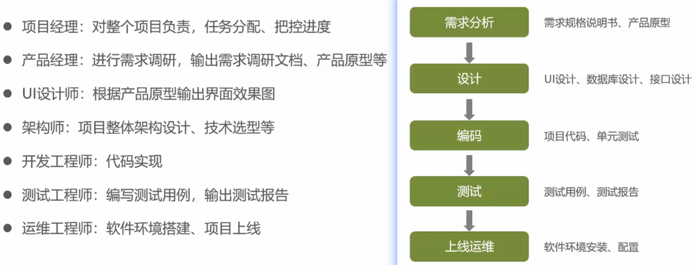

For us software engineer, we cares more about the middle procedure, that is 

1. Select the tech architecture, design DB table and APIs.
2. Devlop and unit test.

Before we did it, we will attend some meetings talking about requirements, sepecifications and the deadline maybe.

After we finish writing all the codes, we will first put the code into DEV env to have joint debug with front engineer, then deploy to Integration env and ask QA team do several testing and give the testing reports. Then let project/products managers and some other users to have a test too. When everything is okay, we will write a release notes and send it to DevOps team to deploy it offically.

## DEV/STG/PRD environment


Mostly, we have 3 different envs for different purposes.

1. DEV: Only front and backend engineers.
2. TEST/STAGE/Integration/SandBox: Similar performance to PRD, designed for testing (QA team, PMs, relateds users)
3. PRD: Online env for bisness purpose.

## Tech architecture selection

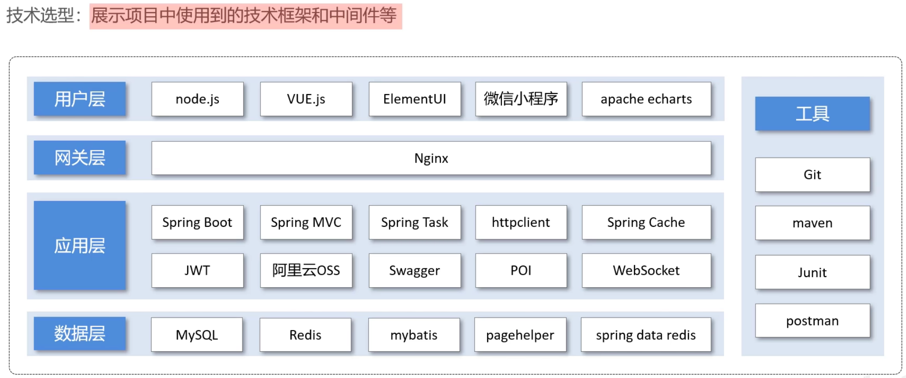

This is actually an MVC architecture. 

- The first 2 layers are technology for front engineers, which is the View part.
- The last 2 layers: application(controller) and data(model) is what backend engineers care most about.

And to make sure our scripts are correct, we use junit to self-test, and use postman to mock some data and test the APIs.

## Sky vs Reggie take out

I learned a lot from Reggie these months but get a little tired of it, then I see this upgraded projects on 2023.10.
25.  My current philosophy is to traverse enough projects to better understand the spring projects tech, so suspend deeppen into Reggie and start to learn this.

It cost too much time to review an old project, so I decide to make notes simultaneously when I watch the videos from [bilibili](https://www.bilibili.com/video/BV1TP411v7v6?p=5&vd_source=2cdc3de199e29dc4f7a75c883bb0d11d).

The key upgrade is as follows:

1. Separated front and backend projects. Reggie use springboot to take over front resources, but better option is user nginx to take over front packages(not source code).
2. Use spring task to calculate the data metric.

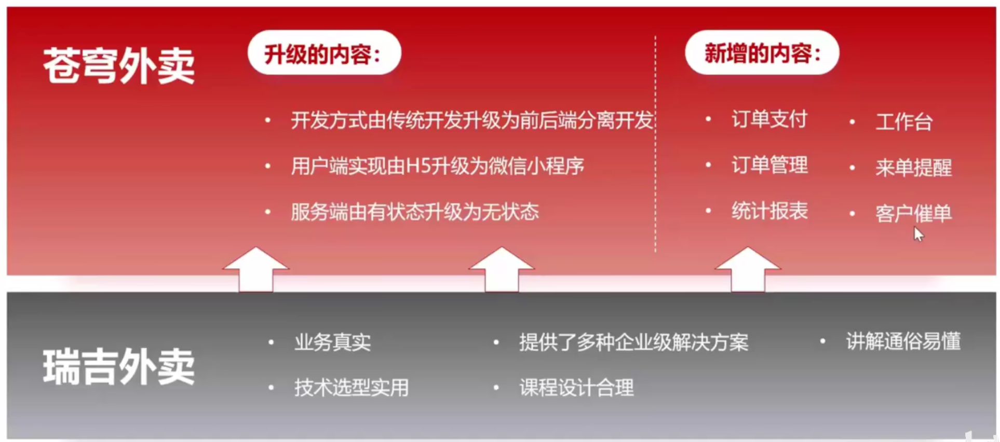

# Front & prepare

## About NPM

NPM is short for node.js package manager, it stores all the dependencies in this path: `/Users/liukai/.nvm/versions/node/v16.20.2/lib/node_modules/npm`, It is pretty similar to maven, aslo have a hidden folder in current user home path and manage different versions of packages.

As like java spring projects, we use cmds provided by spring boot to start the service, or we can build it into binary wars, so we can use a web server like tomcat to run it. In Node.js, we can also use cmds provided by npm to start the service from source codes, or we can build it into binary packages and user a proxy like nginx to run it.

## Run from src

All the dependencies are in the `package.json` file. Vue projects can be run via npm through a service called `vue-cli-service`.

Usually just run `npm run dev`

If failed, delete some conflict versions and use `npm install <conflic_pkg_list>` to solve the conflict manually. 

```shell
// "eslint": "^6.2.2",
"eslint": "^6.7.2",
"eslint-plugin-vue": "^5.2.3",
npm uninstall eslint eslint-plugin-vue babel-eslint
npm install eslint eslint-plugin-vue babel-eslint
```

If always have some dependency problem, try using this cmd to remove all the conflicts and install others

```shell
npm uninstall fibers && rm package-lock.json && rm -R node_modules && npm install
```

## Install & run from nginx

[Install nginx on Mac by brew / not recommended](https://www.javatpoint.com/installing-nginx-on-mac)

```shell
The default port has been set in /opt/homebrew/etc/nginx/nginx.conf to 8080 so that
nginx can run without sudo

nginx will load all files in /opt/homebrew/etc/nginx/servers/.

# To start nginx now and restart at login:
brew services start nginx
# stop nginx
brew services stop nginx

# test connection
curl http://127.0.0.1:8080
```

[Install nginx directly from binary installers](https://blog.csdn.net/qq_23858785/article/details/123132765)

It needs to download 3 things and compile them all

```shell
1. nginx http://nginx.org/en/download.html
2. prce lib https://sourceforge.net/projects/pcre/files/
3. openssl https://www.openssl.org/source/
```

### compile nginx

```shell
cd nginx-1.18.0/
sudo ./configure --with-pcre=../pcre-8.45/ 
sudo make
sudo make install
# add to home path
vim ~/.zshrc
export PATH="/usr/local/nginx/sbin:$PATH"
source ~/.zshrc
# run nginx
cd /usr/local/nginx/sbin
sudo ./nginx
```

let's have test 

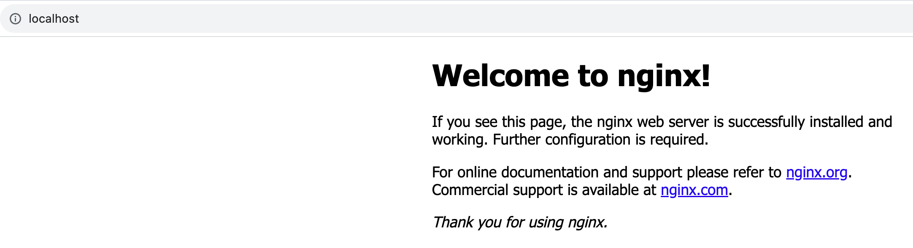

### Nginx usage

```shell
Options:
  -?,-h         : this help
  -v            : show version and exit
  -V            : show version and configure options then exit
  -t            : test configuration and exit
  -T            : test configuration, dump it and exit
  -q            : suppress non-error messages during configuration testing
  -s signal     : send signal to a master process: stop, quit, reopen, reload
  -p prefix     : set prefix path (default: /usr/local/nginx/)
  -e filename   : set error log file (default: logs/error.log)
  -c filename   : set configuration file (default: conf/nginx.conf)
  -g directives : set global directives out of configuration file
```

Nginx use localhost:80 as main page (default port is 80), copy front resources into html folder. It will run in the LAN (local area network).

### reverse proxy

Why is the request url different from what we have in backend scripts? It will lead to error if we donot config the reverse proxy correctly.

The reqeust is not directly linked to the backend service, instead, we have an nginx server, and the reqeust is linked to the nginx server. After that, nginx send a reqeust to backend service (also have a function called load balance)


#### why do we use nginx reverse proxy?


1. Store some cache on nginx side to speed up visiting
2. Load balance. We can send requests to more servers according to certain strategy.
3. Protect backend safety. Prohibit front directly visit the backend service in case of some potential attacking requests.

#### How to config the reverse proxy?

repalce the `api` with` localhost:8080/admin`

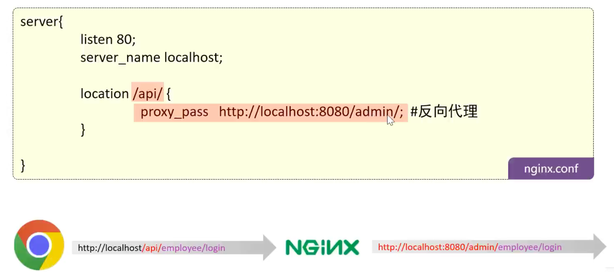

#### How to config the load balance?

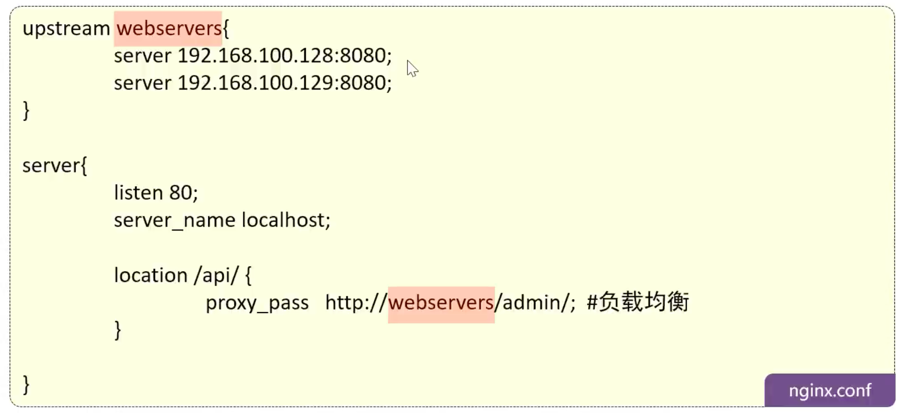

Assume we have 2 servers, gninx can send the request to 2 servers one by one on average. Of course, we have many other strategies, image we have a high-performance computer and a low-performance computer, we can use the weight strategy.

Some strategies about nginx load balance:


#### config the nginx

```shell
cd /usr/local/nginx/conf
sudo vim nginx.conf
# reverse proxy, transmit request to tomcat servers
location /api/ {
	proxy_pass   http://localhost:8080/admin/;
}
# reload the config
sudo nginx -s reload
```

# Backend prepare

## Backend structure intro

- Sky-take-out: parent to control dependency version and children modules.
- Sky-common: store public class, eg tools, common variables, exceptions.
- Sky-pojo: store entity, vo, dto.
- Sky-server: store configurations, controllers, services, mappers.

### 1. Sky-common

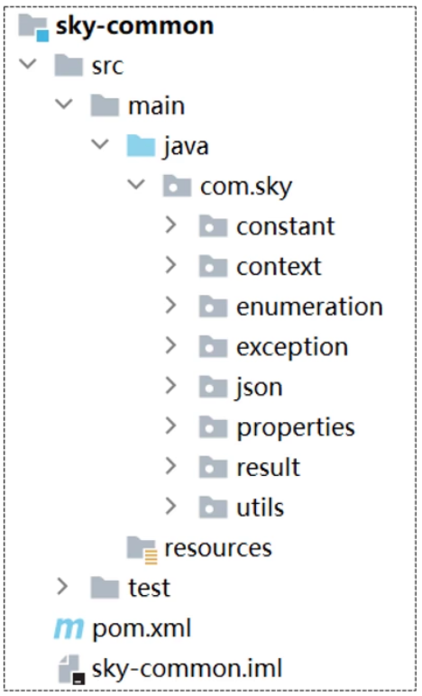

Common module is dependent by other modules as a while.

- context stores something in ThreadLocal like userId
- exception stores self defined exceptions
- json stores some json converters or object mappings
- properties makes spring configuration into property class
- result is a return data structure
- utils stores some user defined utils like SMSUtils

### 2. Sky-pojo

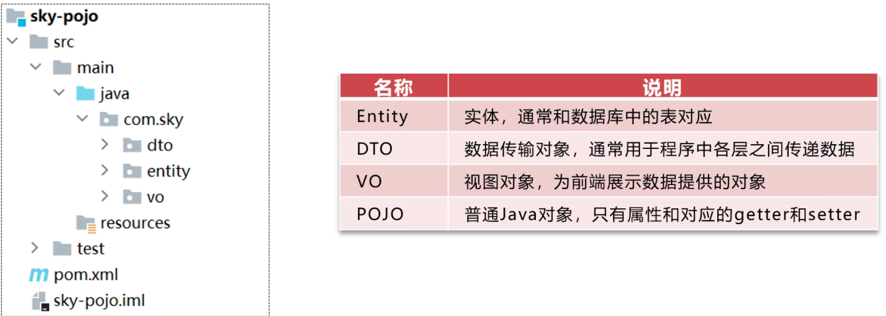

POJO: plain old java object, entity, dto and vo are all POJOs.

- Entity corresponds directly to tables in MySql or PostgreSql database.
- DTO: data transfer object is the data structure returned to the front, usually contains serveral entities or part of entities.
- VO: view object is very much like vo but I cannot tell the difference yet.

### 3. Sky-server


Sky-server is much like reggie project, the booting class is stored in this module.

- config stores all configs, eg MVC, MyBatis, ObjectMapping, Swagger, etc.
- controller can be separated into admin and user
- interceptor stores permission control inteceptor

### Comparision and conclusions about 3 modules

Server module stores all info about business, easy to find all the APIs here.

Pojo treats all the data structure, it does not contains any functions but only fields.

Common module is more like a tool box and non-relative to business logic, it is designed not to be observed but works at backend silently.

### Maven projects in IDEA

Right click on root folder and open module settings, add the parent folder as root module then it will automatically import 3 child modues and mark `java` as Sources, and `resources` as Resources.

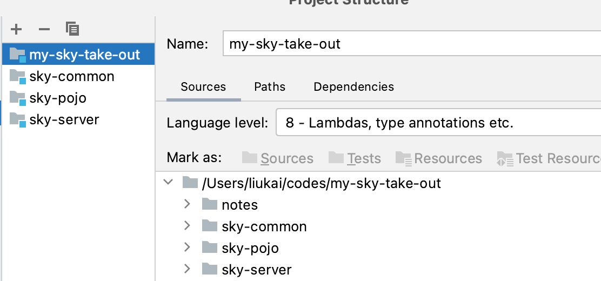

## Version control by Git

VCS: version control system.

You can simply initiate a remote repo on GitHub and then git clone to local.

But this way is much more suggested:

1. Click VCS menu in IDEA and new a git project in current project, after creating the VCS menu will disappear on the IDEA interface.
2.  New a remote repo on GitHub.
3. IDEA will appear a Git toolbar, 3 icons represents pull, commit and push. Click on commit, select files and fill the commit msg, then click commit. Click push, it will pop up a window telling you to add the remote repo.

Usually, we don't want git manage all the data, like compiled classes, IDEA configs, new a .gitignore file in current project and add the folders to it.

```shell
.idea
**/test/
```

## Data model & DB init

We need an API for controllers, also we need a specification for all tables. Here is a database design documents.

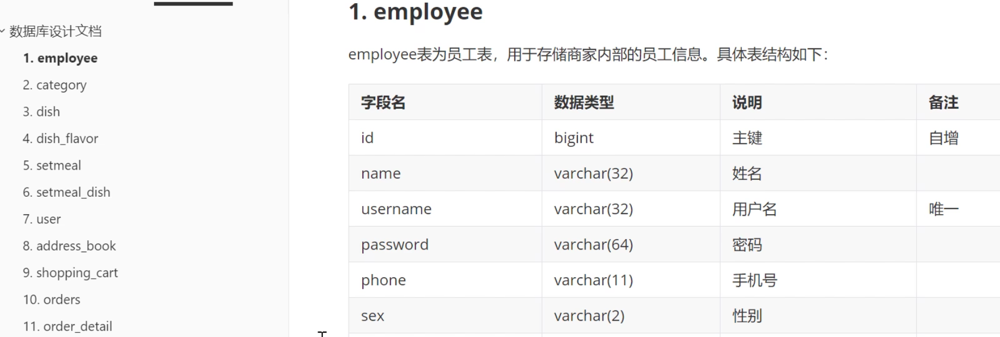

Usually we analyzed the data model first and design the table before development. But for now let's just be simple, execute all the sql cmds to create all the database and tables.

```sql
CREATE DATABASE IF NOT EXISTS `sky_take_out`;
USE `sky_take_out`;
```

The data model is as follows.


The core is `user` , `dish`, and `orders` , which corresponds to a famous theory "people goods market". All the other tables are designed around this 3 core concepts. Here is the explaination about these 11 tables using this theory.

- People: here represents common users, they have address_book. Also we have employee table here, those people are admins.
- Goods: here is dish and setmeal, setmeal is a group of dishes. Dish has flavors, dish has categories, and between dish and flavor there should be a detailed mapping relationships called dish_flavor. Between dish and setmeal there is a relationship table called setmeal_dish.
- Market: when people buy goods, then there is a market/order. Before the order becomes reality it should be shopping_cart. Each order can have lots of goods, so the goods detail is the order_detail table. 

MySql can import the data through certain sql files. Import data from the Server menu.

# Joint debug between font & backend

Before we debug,  there are several things to do

1. Init the DB and config the link info in application.yml properly.
2. Compile the parent module first to assure all child modules pass the check.


There is a boot application toolbar too, we can click the bug(worm) icon to debug the whole backend application. Add a break point to certain lines so we can view the detailed information of some middle variables.

Then we can use postman to test the apis. Be careful with the request method, and the post body should be in raw json format rather than form-data.


If the postman pass, but front failed, need to install nginx, use nginx to host front projects, config nginx.conf proxy reverse, and then have a try.

# Password & MD5

MD5: Message Digest Algorithm.

MD5 is commonly used in password because it can not be reversed from md5 string to raw strings. In java, we have a DigestUtils to generate md5 strings.

```java
password = DigestUtils.md5DigestAsHex(password.getBytes());
```

# Import API doc & YApi

Api design is a very important period during software devlopment.

In most projects which separate front and backend, we are highly relied on API. Through this way, front and backend engineers can work at the same time.


[YApi](https://yapi.pro/group/155524)/ApiFox is a good website to manage apis.

# Swagger VS Postman

If we have tons of Apis, using postman will be a trouble.

There is a framework called knife4j

## how to use swagger

Step 1 import cordinates of knife4j

```xml
<dependency>
    <groupId>com.github.xiaoymin</groupId>
    <artifactId>knife4j-spring-boot-starter</artifactId>
</dependency>
```

Step 2 add configuration of knife4j. (this config is Docket) swagger use reflection to know all the controllers after the basePackage is specified.

```java
public Docket docket() {
  ApiInfo apiInfo = new ApiInfoBuilder()
          .title("苍穹外卖项目接口文档")
          .version("2.0")	// set version 2.0
          .description("苍穹外卖项目接口文档")
          .build();
  Docket docket = new Docket(DocumentationType.SWAGGER_2)
          .apiInfo(apiInfo)
          .select()
          // specify module that we want to scan
      .apis(RequestHandlerSelectors.basePackage("com.sky.controller"))
          .paths(PathSelectors.any())
          .build();
  return docket;
}
```

Step 3 set static resource mapping, otherwise spring will think that `/doc.html` should be some controller but he cannot find that controller.

```java
protected void addResourceHandlers(ResourceHandlerRegistry registry) { registry.addResourceHandler("/doc.html").addResourceLocations("classpath:/META-INF/resources/"); registry.addResourceHandler("/webjars/**").addResourceLocations("classpath:/META-INF/resources/webjars/");
}
```

## use swagger to test

swagger can be executed like postman and is better than postman.

Visit this website: http://localhost:8080/doc.html#/home

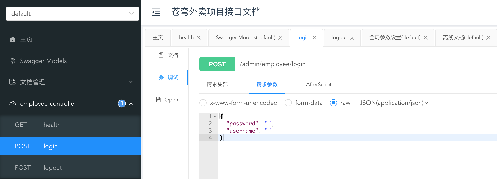

## comments in swagger

We can add some comments to swagger so that the API document is easier to read. It is very like something we add to the table when we init a sql table.

Usually, we add Api to controller, ApiOperation to method, ApiModel to pojo, ApiModelProperty to field of pojo. After adding some comment and refresh the swagger online api documents, we can see the updates in real time.


## swagger vs postman vs YApi

swagger reflects the controller already implemented in backend service, swagger can both generate the api document and test the api like postman.

postman will be a trouble when there are too many apis, but if the project is too simple and there is no swagger, postman can still work.

YApi will not change after the api is designed, it is a reference.

